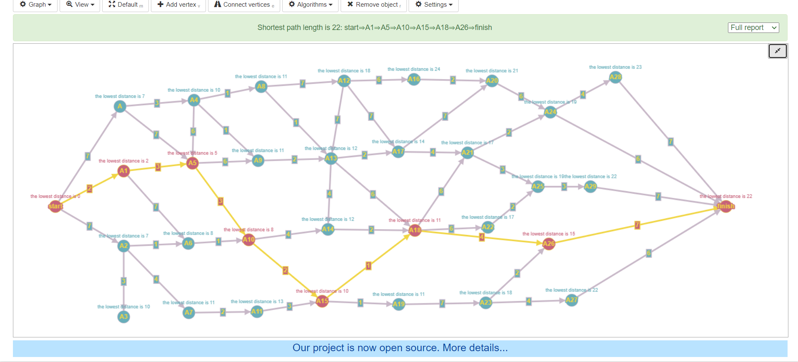
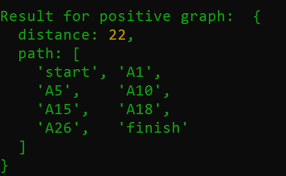
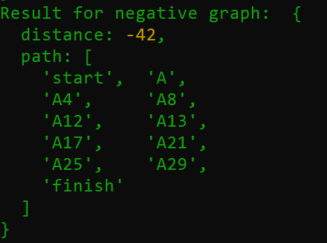
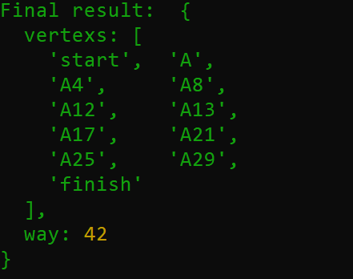

# Лабораторная работа №4: Исследование принципов проектирования и работы динамического и статического планирования

##### Алгоритм поиска критических вершин:
Генерируем изначальный граф. Граф должен быть **ациклический и взвешенный**. Число вершин должно быть не меньше 30. Задача на поиск критических вершин заключается в следующием:
1. Найти максимальный путь в графе.
2. Все вершины что вошли в данный путь есть критическими вершинами.
3. Вычислить сложность данного алгоритма.

Алгоритм работы: 
1. Сгенерировать граф.
2. Поменять все веса ребер на противоположные.
3. Найти все вершины что вошли в данный путь.

Вычисление сложности алгоритма:  **O(E)+O(n^2) = O(E + n^2)**;
где:
1. **O(n^2)** - сложность алгоритма Дейкстры.
2. **O(E)** - изменение весов ребер.
3. **Е** - колличесвто ребер.

1) 

Визуализация изначального графа

1) 

Пример работы алгоритма Дейкстры на обычном взвешенном графе.

2) 

Пример нахождения максимально пути и критических вершин.

3) 

Конечный результат. Максимальный путь и критические вершины
